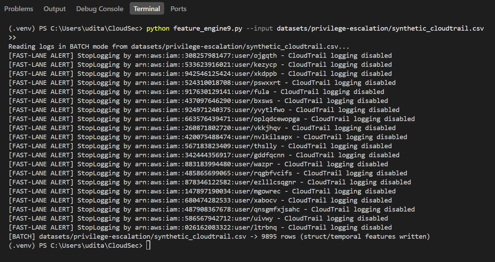

# CloudSec
 # For AssumedRole/FederatedUser events, userIdentity.arn is suffixed with
    # a unique session name (e.g. .../EC2_Service_Role/i-0abc123), so it's
    # different on every session. sessionIssuer.arn is the stable underlying
    # role ARN and is what should identify the principal across sessions --
    # falling back to userIdentity.arn only for principal types (IAMUser,
    # Root) that don't have a sessionIssuer at all.
--------------------------------------------------------------------------------------
 # Same stability concern as principal_arn: for AssumedRole/FederatedUser
    # events userIdentity.userName is usually absent, so fall back to the
    # role name off sessionIssuer.arn (the human/service identity that
    # actually owns the role), then to the tail of principal_arn itself.
--------------------------------------------------------------------------------------
# read_only / mfa_authenticated: kept as None when genuinely absent from
    # the source log, instead of defaulting to a guessed value -- see fe8.
--------------------------------------------------------------------------------------
    # recipientAccountId is the account a real CloudTrail trail belongs to --
    # present at the top level of real CloudTrail JSON, absent from this
    # project's synthetic CSV. Used as the authoritative "home account" for
    # is_cross_account when available (see GraphNodeTracker.cross_account_flag).
--------------------------------------------------------------------------------------
            # A real CloudTrail file delivered to S3 is ONE JSON object shaped
            # like {"Records": [...]}, not a top-level array -- so both '{'
            # and '[' need to attempt the whole-document parse. If the file is
            # actually NDJSON (one object per line), json.load() will fail
            # with "Extra data" once it hits the second line's worth of
            # content, and we fall back to line-by-line parsing below.
--------------------------------------------------------------------------------------
# AWS's actual documented userIdentity.type values. Fixed/closed: anything
# not on this list (there shouldn't be anything) maps to <UNK> rather than
# growing the vocab, since this is a small, AWS-defined enum.
--------------------------------------------------------------------------------------
# Scoped to the services this project's Stratus Red Team techniques and
# background traffic actually touch (see stratus_collection/stratus_techniques.py),
# not all ~300 AWS service endpoints. Fixed/closed with <UNK> fallback.
--------------------------------------------------------------------------------------
class vocabindex:   """Maps categorical string values to stable integer indices.

    Fixed vocabs (growable=False) never add new entries -- unseen values
    map to <UNK>. Growable vocabs (event_name) start from a persisted JSON
    file and append newly-seen values, so indices stay stable across runs.
    Once a model is trained against a growable vocab file, stop growing it
    (or the embedding table size drifts out from under the trained model).
    """
--------------------------------------------------------------------------------------
parse_policy_features: """Returns (statement_count, has_wildcard_action, has_wildcard_resource,
    privileged_action_reach) parsed from a request's policy-bearing params.

    Handles both real CloudTrail's nested policyDocument/
    assumeRolePolicyDocument JSON (with real Statement/Action/Resource) and
    this project's synthetic data, which instead just attaches a
    policyArn (often literally .../AdministratorAccess) with no nested doc.
    """
--------------------------------------------------------------------------------------
get_resource_criticality: """Static, hand-scored criticality per resource -- same style as the
    existing action_map/principal_risk_prior hand-tuned priors. Computed
    once per event; a downstream Blast Radius Engine reads this instead of
    re-deriving criticality from event_source/target_resource itself."""
--------------------------------------------------------------------------------------
derive_privilege_signal: """One event's evidence about its principal's privilege tier -- fed into
    GraphNodeTracker's running MAX per principal. CloudTrail only shows
    permission grants as they happen, so a principal's inferred tier can
    only climb as escalating events are observed, never silently regress."""
--------------------------------------------------------------------------------------
graph_node_tracker: """Tracks per-node graph attributes (degree, age, privilege level,
    historical risk) and per-edge interaction counts, incrementally -- one
    CloudTrail event at a time, the same streaming pattern StateTracker
    already uses for velocity/session state.

    These are exactly the attributes flagged as cheap/streamable (Node
    Degree, Edge Interaction Count, Node Age, Privilege Level, Historical
    Risk, Cross-Account Flag) -- as opposed to graph-traversal features
    (reachability, shortest attack path, blast radius), which need the
    whole graph and belong in a separate downstream Blast Radius Engine.

    Note: degree is tracked for every node this project's graph touches
    (principals AND resources), even though the structural CSV only
    surfaces source_node_degree per row -- a resource's degree is still
    available in the persisted state file for that future Blast Radius
    Engine to read directly, without re-deriving it.

    Persisted to `path` so a --watch restart doesn't reset every node back
    to "brand new" (same reasoning as StateTracker/VocabIndex).
    """
--------------------------------------------------------------------------------------
record_edge: """Updates degree/age/interaction-count/risk/privilege for one
        CloudTrail event, and returns the snapshot values to attach to
        that event's structural row."""
--------------------------------------------------------------------------------------
cross_account_flag: 
        # Fallback for sources without a trail-level account id (e.g. this
        # project's synthetic CSV): treat whichever account has been seen
        # most often so far as "home", flag anything else as cross-account.
--------------------------------------------------------------------------------------
state_tracker: """Tracks historical + session behavior to detect Privilege Escalation
    and Velocity (both single-hop and session-level).

    Persisted to `path` (like VocabIndex) so a watch-mode restart doesn't
    reset every principal's velocity/session state back to "brand new" --
    without this, action_velocity/is_new_action/session_duration_normalized
    would all silently reset to their first-ever-seen values on restart,
    even mid-session for a principal that had been active for hours.
    """
--------------------------------------------------------------------------------------
rewrite_temporal_sorted: """Keeps cloudtrail_temporal.csv globally sorted by (username,
    timestamp), not just in file-arrival order.

    CloudTrail doesn't guarantee event order within a single delivered log
    file, let alone across files -- and in --watch mode, files can land out
    of chronological order. A downstream sliding-window/LSTM script needs to
    group by username and walk events in order, so that invariant is
    maintained here rather than left for every consumer to re-sort.

    Re-sorts the whole file on every batch (existing rows + new rows). Fine
    at this project's data scale (thousands of rows); a high-volume
    production stream would want a merge step or an external sort instead.

    Written to a .tmp file in the same directory and then os.replace()'d
    into place, rather than truncating cloudtrail_temporal.csv directly --
    os.replace is atomic on both POSIX and Windows, so a crash mid-rewrite
    leaves either the old complete file or the new complete file, never a
    half-written one. (The append-only STRUCT_OUT doesn't need this: losing
    the tail of an in-progress append only risks the single row being
    written, not the whole file's history.)
    """
--------------------------------------------------------------------------------------

--------------------------------------------------------------------------------------

--------------------------------------------------------------------------------------

--------------------------------------------------------------------------------------

--------------------------------------------------------------------------------------

--------------------------------------------------------------------------------------

--------------------------------------------------------------------------------------

--------------------------------------------------------------------------------------
--------------------------------------------------------------------------------------
--------------------------------------------------------------------------------------
--------------------------------------------------------------------------------------
--------------------------------------------------------------------------------------
--------------------------------------------------------------------------------------
--------------------------------------------------------------------------------------
--------------------------------------------------------------------------------------
--------------------------------------------------------------------------------------
--------------------------------------------------------------------------------------
--------------------------------------------------------------------------------------